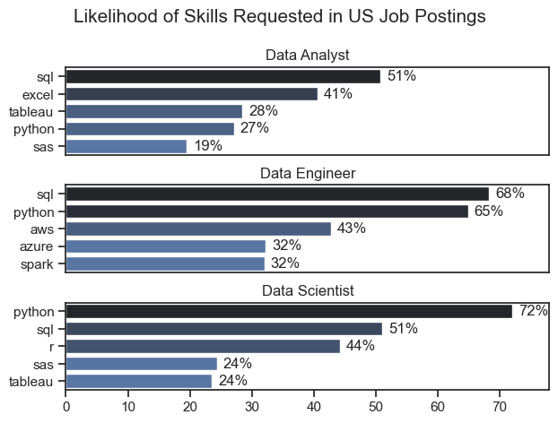

# Overview

Welcome to my analysis of the data job market, with a focus on data analyst roles. This project was created to help me better understand the landscape of data-focused careers and uncover actionable insights for improving my skills. As a recent graduate with a deep interest in business and data analytics, I wanted to learn more about what the job market is looking for in data professionals—especially which skills are in demand and which ones pay the most.

This project uses the same dataset provided in [Luke Barousse’s Python Course](https://www.lukebarousse.com/python), which includes thousands of job postings with detailed information on job titles, skills, salaries, and locations. I applied the Python skills learn throughout this course to explore the data and answer key questions about the skills, trends, and salaries tied to data roles. This helped me, an aspiring data analyst, gain a clearer understanding of the most valuable skills to develop and the potential career paths within the data analytics field.


# The Questions

Below are the questions I set out to answer through this analysis:

1. What are the skills most in demand for the top 3 most popular data roles?

2. How are in-demand skills trending for Data Analysts?

3. How well do jobs and skills pay for Data Analysts?

4. What are the optimal skills for data analysts to learn? (High Demand & High Paying)


# The Tools Used

To complete this project, I used a variety of tools and libraries that helped me organize, analyze, and visualize the data:

To complete this project, I used a variety of tools and libraries that helped me organize, analyze, and visualize the data:

* **Python:** The primary language I used to clean and analyze the dataset. It allowed me to work with the job market data and extract meaningful information. I also used the following Python libraries"
    * **Pandas Library:**  Used for data manipulation and analysis.
    * **Matplotlib Library:** Used for data visualization.
    * **Seaborn Library:** Used for more advanced visualizations.

* **Jupyter Notebooks:** Allowed me to combine code, output, and notes in a single place for easier storytelling.

* **Visual Studio Code:** My preferred code editor for  executing the Python scripts I developed in the Jupyter Notebooks.

* **Git & GitHub:** Used for version control and sharing my code.


# The Data Preparation & Cleanup

This section details how I prepared the job market data for analysis, ensuring it was clean and ready for exploration – a crucial step we learned in the course.

## Importing & Cleaning the Data

```python

# Importing Libraries
import ast
import pandas as pd
import seaborn as sns
from datasets import load_dataset
import matplotlib.pyplot as plt  

# Loading Data
dataset = load_dataset('lukebarousse/data_jobs')
df = dataset['train'].to_pandas()

# Data Cleanup
df['job_posted_date'] = pd.to_datetime(df['job_posted_date'])
df['job_skills'] = df['job_skills'].apply(lambda x: ast.literal_eval(x) if pd.notna(x) else x)

```

## Filtering the Data Down to the U.S.

```python
# Filtering for the U.S.
df_US = df[df['job_country'] == 'United States'].copy()


# Filtering for the U.S. and Data Analyst roels
df_DA_US = df[(df['job_title_short'] == 'Data Analyst') & (df['job_country'] == 'United States')].copy()

```


# The Analysis

## 1. What are the most demanded skills for the top 3 most popular data roles?

To identify the top skills in demand, I analyzed job postings from a dataset focused on data-related roles in the U.S. I filtered the data by the top 3 most popular job titles and visualized the five most frequently mentioned skills for each using horizontal bar plots. The visualizations show the likelihood of each skill appearing in job postings, helping highlight which technical abilities are most valued across roles such as Data Analyst, Data Engineer, and Data Scientist.

Here is the link to my notebook to see a detailed breakdown of the steps taken: [2_Skills_Demand.ipynb](3_Project/2_Skills_Demand.ipynb)


### Code

```python

fig, ax = plt.subplots(len(job_titles), 1)

sns.set_theme(style='ticks')

for i, job_title in enumerate(job_titles):
    df_plot = df_skills_perc[df_skills_perc['job_title_short'] == job_title].head(5)
    sns.barplot(data=df_plot, x='skill_percent', y='job_skills', ax=ax[i], hue='skill_count', palette='dark:b_r')
    ax[i].set_title(job_title)
    ax[i].set_ylabel('')
    ax[i].set_xlabel('')
    ax[i].get_legend().remove()
    ax[i].set_xlim(0, 78)


    for n, v in enumerate(df_plot['skill_percent']):
        ax[i].text(v + 1, n, f'{v:.0f}%', va='center')

    
    if i != len(job_titles) - 1: 
        ax[i].set_xticks([])

fig.suptitle('Likelihood of Skills Requested in US Job Postings', fontsize=15)
fig.tight_layout(h_pad=.8)
plt.show()

```

### Visualization


*These bar graphs shows probability the top 5 skills of each of the top 3 data roles appearing in a job post.*


### Insights

**Skill-Specific Insights:**

* **SQL is highly valued across all three roles:** It is the most frequently requested skill for **Data Analysts (51%)** and **Data Engineers (68%)**, and the second most requested for **Data Scientists (51%)**. This underscores the fundamental importance of database interaction, querying, and management in data-related fields.

* **Python is a highly demanded skill for both Data Engineers and Data Scientists:** It is the top requested skill for **Data Scientists (72%)** and the second most requested for **Data Engineers (65%)**. It also has a significant presence in **Data Analyst** roles (**27%**), indicating the importance of programming along with data manipulation, analysis, and modeling to perform data-related tasks.

**Role-Specific Insights:**

* **Data Analyst:** Requires skills in data manipulation (**SQL**, **Excel**) and data visualization (**Excel**, **Tableau**). Some programming/scripting knowledge (**Python**, **SAS**) would also be beneficial. The focus seems to be on extracting, cleaning, analyzing, and presenting data insights.

* **Data Engineer:** Demands skills in data manipulation (**SQL**), programming (**Python**), cloud technologies (**AWS**, **Azure**), and big data technologies (**Spark**). The focus seems to be on using data infrastructure and processing skills to build and maintain data pipelines.

* **Data Scientist:** Seeks skills in programming (**Python**, **R**), data manipulation (**SQL**), and statistical analysis (**R**, **SAS**). Some skills in data visualization (**Tableau**) would also be notable. The focus seems to be on building predictive models and extracting complex insights.


## 2. How are in-demand skills trending for Data Analysts?

To understand how demand for specific skills has evolved, I tracked the top 5 most requested skills for Data Analyst roles over time. Using a line plot, I visualized trends in the likelihood of each skill appearing in U.S. job postings throughout 2023. This analysis provides insight into which skills are gaining or losing popularity, helping job seekers align their learning with current industry needs.

Here is the link to my notebook to see a detailed breakdown of the steps taken: [3_Skills_Trend.ipynb](3_Project\3_Skills_Trend.ipynb)


### Code

```python

df_plot = df_DA_US_percent.iloc[:, :5]
sns.lineplot(data=df_plot, dashes=False, legend='full', palette='tab10')
sns.set_theme(style='ticks')
sns.despine()

plt.title('Trending Top Skills for Data Analysts in the US')
plt.ylabel('Likelihood in Job Posting')
plt.xlabel('2023')
plt.legend().remove()

from matplotlib.ticker import PercentFormatter
ax=plt.gca()
ax.yaxis.set_major_formatter(PercentFormatter(decimals=0)) # Getting rid of the decimal

for i in range(5):
    plt.text(11.2, df_plot.iloc[-1, i], df_plot.columns[i])

plt.show()


```

### Visualization

*This line graph shows the top 5 trending skills for data analysts in the U.S. for 2023.*

### Insights

* **SQL consistently remains the most in-demand skill:**  Throughout the year, **SQL** has had the highest likelihood of being requested in Data Analyst job postings, generally hovering above the 55% mark and only dipping slightly towards the end of the year. This reinforces **SQL's** fundamental importance for data analysis roles.

* **Excel ia a consistently important skill, but with fluctuations:** **Excel** consistently ranks as the second most requested skill. However, its demand showed more variability throughout the year, with a notable peak around July and August and then declining before rising again towards the end of the year.

* **Python and Tableau exhibit a generally upward trend:** Both **Python** and **Tableau** showed a tendency to be requested more frequently as the year progressed, suggesting their growing relevance in the Data Analyst skillset. **Tableau** showed a particularly noticeable increase in the later months.

* **Power BI shows relatively stable but lower demand:** **Power BI** consistently had the lowest likelihood of being requested among the skills presented, with relatively minor fluctuations throughout the year. **Power BI** generally remains in the 20-25% range.


## 3. How well do jobs and skills pay for Data Analysts?

To evaluate salary trends for U.S-based Data Analysts, I created visualizations to compare compensation across job titles and skills. A box plot displays salary distributions for the top 6 data roles, offering a clear view of pay ranges in the U.S. I also identified the top 10 highest-paying and top 10 most in-demand skills for Data Analysts in the United States, using bar charts to show how each skill correlates with median salary. This dual analysis helps highlight both lucrative and widely requested skills in the current job market.

Here is the link to my notebook to see a detailed breakdown of the steps taken: [4_Salary_Analysis.ipynb](3_Project\4_Salary_Analysis.ipynb)

### Salary Analysis :

### Code

```python

sns.boxplot(data=df_US_top6, x='salary_year_avg', y='job_title_short', order=job_order)
sns.set_theme(style='ticks')


plt.title('Salary Distributions of Data Jobs in the US')
plt.xlabel('Yearly Salary (USD)')
plt.ylabel('')
plt.xlim(0, 600000) 
ticks_x = plt.FuncFormatter(lambda y, pos: f'${int(y/1000)}K')
plt.gca().xaxis.set_major_formatter(ticks_x)
plt.show()

```

### Visualization

*This box plot shoes the salary distributions for the top 6 data roles.*

### Insights

* **Salaries generally increase with seniority.** The graph shows a positive correlation exists between job level and salary; for instance, the Senior Data Scientists and Senior Data Engineers have higher median and overall salaries compared to their non-senior counterparts.

* **Data Science and Data Engineering roles tend to have higher salary potential.** For both senior and non-senior roles, the box plots for Data Scientist and Data Engineer positions are generally positioned higher on the salary scale compared to Data Analyst roles. This suggests that roles involving more advanced modeling, programming, and infrastructure responsibilities often command higher compensation.   

* **Significant salary overlap exists between different roles and seniority levels.** While the medians and overall distributions differ, there's a considerable overlap in the salary ranges between adjacent roles and seniority levels. For instance, some experienced Data Analysts might earn within the range of entry-level Data Scientists or Data Engineers. Similarly, the lower end of Senior Data Scientist salaries can overlap with the higher end of Data Scientist salaries.

### The Highest Paid & Most Demanded Skills for Data Analysts in the U.S.:

### Code

```python

fig, ax = plt.subplots(2, 1)  

sns.set_theme(style='ticks')

# Top 10 Highest Paid Skills for Data Analysts
sns.barplot(data=df_DA_top_pay, x='median', y=df_DA_top_pay.index, hue='median', ax=ax[0], palette='dark:b_r')
ax[0].legend().remove()
ax[0].set_title('Top 10 Highest Paid Skills for Data Analysts in the US')
ax[0].set_ylabel('')
ax[0].set_xlabel('')
ax[0].xaxis.set_major_formatter(plt.FuncFormatter(lambda x, _: f'${int(x/1000)}K'))


# Top 10 Most In-Demand Skills for Data Analysts')
sns.barplot(data=df_DA_skills, x='median', y=df_DA_skills.index, hue='median', ax=ax[1], palette='light:b')
ax[1].legend().remove()
ax[1].set_title('Top 10 Most In-Demand Skills for Data Analysts in the US')
ax[1].set_ylabel('')
ax[1].set_xlabel('Median Salary (USD)')
ax[1].set_xlim(ax[0].get_xlim()) 
ax[1].xaxis.set_major_formatter(plt.FuncFormatter(lambda x, _: f'${int(x/1000)}K'))


plt.tight_layout()
plt.show()

```

### Visualization

*This bar chart shows the highest paid skills (top graph) and median salary for the most in-demand skills (bottom graph) for data analysts in the US.*

### Insights

* **A disconnect between highest paid and most in-demand:** There's a significant difference between the skills that command the highest salaries and those that are most frequently sought after. The highly paid skills are more niche and specialized, while the most in-demand skills are the foundational tools of data analysis.

* **Traditional data analysis tools dominate in-demand skills:** The most in-demand skills are those commonly associated with core data analysis tasks: "python," "tableau," "r," "sql server," "sql," "sas," "power bi," and "excel."

* **Microsoft products occupy 5 out of the top 10 most in-demand skills for Data Analysts**, including SQL Server, Power BI, Excel, PowerPoint, and Word.


## 4. What is the most optimal skill to learn for Data Analysts?

To determine the most optimal skill for Data Analysts, I created a scatter plot comparing the demand (measured by job posting frequency) and median salary of various skills. Each point represents a skill, with its position indicating both how common it is and how well it pays. Using label adjustments to reduce overlap, the visualization helps highlight high-demand, high-paying skills—making it easier to identify which skills offer the best balance of marketability and earning potential.


Here is the link to my notebook to see a detailed breakdown of the steps taken: [5_Optimal_Skills.ipynb](3_Project\5_Optimal_Skills.ipynb)


### Code

```python

from adjustText import adjust_text

#df_plot.plot(kind='scatter', x='skill_percent', y='median_salary')
sns.scatterplot(
    data=df_plot,
    x='skill_percent',
    y='median_salary',
    hue='technology'
)

sns.despine()
sns.set_theme(style='ticks')

# Preparing texts for aadjustText
texts = []
for i, txt in enumerate(df_DA_skills_high_demand.index):
    texts.append(plt.text(df_DA_skills_high_demand['skill_percent'].iloc[i], df_DA_skills_high_demand['median_salary'].iloc[i], txt))

# Adjust text to avoid overlap
adjust_text(texts, arrowprops=dict(arrowstyle='->', color='gray'))

from matplotlib.ticker import PercentFormatter
ax=plt.gca()
ax.yaxis.set_major_formatter(plt.FuncFormatter(lambda y, pos: f'${int(y/1000)}K'))
ax.xaxis.set_major_formatter(PercentFormatter(decimals=0))

plt.xlabel('Percent of Data Analyst Jobs')
plt.ylabel('Median Yearly Salary')
plt.title('Most Optimal Skills for Data Analyst in the US')

plt.tight_layout()
plt.show()

```

### Visualization

*The scatter plot shows the most optimal skills (based on salary and demand) for data analysts in the US.*

### Insights

* **High Value with Programming Skills:** The programming skills (colored blue) demonstrate significant potential. Python commands the highest salary, indicating its value in the market, while SQL has the highest demand, highlighting its fundamental importance across many Data Analyst roles. This implies that developing strong programming skills, particularly in Python and SQL, is highly beneficial for both earning potential and job opportunities in data analysis.

* **Potential with Analytical Tools:** Analytical tools (colored orange) Tableau and Power BI occupy a middle ground in terms of both demand (percentage of job postings) and salary, suggesting they are frequently used and offer a competitive average compensation. In contrast, while Excel exhibits the second-highest demand, indicating its widespread use across Data Analyst roles, it also presents one of the lower median salaries on the chart. This might imply that Excel proficiency is often an expected baseline skill for many data-related positions, contributing to its high demand, but specialized analytical tools like Tableau and Power BI are associated with roles requiring more in-depth analysis and thus command a higher pay.

* **Specialization with Databases and Cloud Technology:** Oracle and SQL Server offered some of the highest salaries but exhibit the lowest demand in Data Analyst job postings. This may indicate that these skills are highly valued for specific, more specialized roles or within particular types of organizations, but they are not broadly required across the majority of Data Analyst positions. In contrast, focusing on programming skills and analytical tools, which together constitute a larger proportion of the high-demand and reasonably well-compensated skills, might represent a more broadly applicable and potentially more accessible path for many aspiring and current Data Analysts.


# Ths Skills Learned & Knowledged Gained

Throughout this project, I not only gained valuable insights into the data analyst job market but also significantly improved my foundational Python skills, which is the main goal of this course! Here are a few specific things I learned as a new Python user:

* **Practical Application of Python Libraries:** This project gave me hands-on experience using key Python libraries like Pandas for data manipulation, Seaborn and Matplotlib for creating visualizations. Seeing how these libraries work together to analyze real-world data has made the concepts we learned in the course much clearer and more impactful.

* **The Power of Data Manipulation with Pandas:** I learned how to effectively use Pandas DataFrames to filter, sort, and group data – essential skills for any data-related task. This project showed me how Python can make working with large datasets manageable and insightful.

* **Visualizing Data for Understanding:** Creating different types of plots with Matplotlib and Seaborn helped me see patterns and trends in the job market data that would have been difficult to grasp just by looking at numbers. This highlighted the importance of data visualization, a key topic in our course.

* **Developing a Data Analysis Mindset:** This project took me through the entire process of asking questions, preparing data, analyzing it with Python, and then visualizing the results. This end-to-end experience has helped me begin to develop a more structured and analytical mindset for approaching data-related problems.

* **Debugging, Troubleshooting, and Problem-Solving:** As a new Python learner, I inevitably encountered errors and challenges while writing the code. Working through these issues helped me develop my problem-solving skills and become more comfortable with the Python syntax and error messages. This is a crucial part of learning to code!


# The Insights

This project provided several key insights into the data job market for aspiring analysts like myself, and also reinforced some important lessons about data analysis using Python:

* **The Tangible Value of Python Skills:** Seeing how Python (and libraries like Pandas and Seaborn) could be used to analyze real job market data made the skills I'm learning in this course feel much more tangible and valuable. Understanding that Python is a core tool for extracting insights and understanding trends in a field I'm interested in is really motivating.

* **Understanding the Interplay of Demand and Salary:** The analysis clearly showed that the most frequently requested skills aren't always the highest paying, and vice versa. This highlights the strategic decisions aspiring data analysts need to make about which skills to prioritize based on their career goals – whether it's maximizing immediate job prospects or aiming for higher earning potential in more specialized areas.

* **The Foundational Importance of SQL**: The consistent high demand for SQL across different data roles underscores that database querying is a fundamental skill for anyone working with data. This reinforces the importance of mastering SQL as a core competency early in my career. I am happy I took the Luke Barousse's [SQL for Data Analyst](https://www.lukebarousse.com/sql) course

* **The Growing Relevance of Python and Specialized Tools:** The upward trend of Python and Tableau for Data Analysts suggests that programming and advanced visualization skills are becoming increasingly important. This encourages me to continue developing these skills beyond the basics covered in the course.

* **Microsoft Tools as a Common Entry Point:** The significant presence of Microsoft products in the most in-demand skills indicates that familiarity with tools like Excel and Power BI is often a baseline expectation for many Data Analyst roles. This suggests that building proficiency in these accessible tools can be a good starting point.

* **Specialization Can Lead to Higher Pay:** The higher salaries associated with more niche skills like those in the "highest paid" list indicate that as I gain experience, specializing in a particular area could lead to greater earning potential. This gives me something to consider for future learning and career development.

* **Data Analysis is About Asking Questions and Finding Answers:** This project demonstrated that data analysis isn't just about writing code; it's about formulating meaningful questions about the real world (like "What skills are in demand?") and then using data and tools like Python to find data-driven answers. This has shifted my perspective on what it means to be a data analyst.


# The Challenges Faced

This project, while incredibly rewarding, wasn't without its learning curves, which ultimately helped me grow as a new Python user and aspiring data analyst:

* **Navigating Data Inconsistencies as a Beginner:** As I worked with the real-world job market data, I encountered missing values and inconsistencies. Learning how to identify and handle these using Pandas was a valuable lesson in data cleaning – a crucial skill we discussed in the course. It highlighted that real data isn't always perfect and requires careful attention.

* **Visualizing Complex Data with Limited Experience:** While the course introduced Matplotlib and Seaborn, translating the job market data into clear and insightful visualizations was a challenge. I had to experiment with different plot types and parameters to effectively communicate the trends and relationships I discovered. This process reinforced the importance of thoughtful visualization and helped solidify my understanding of these libraries.

* **The Balancing Act of Exploration and Focus:** As I delved deeper into the data, I found myself wanting to explore many different avenues. A challenge was learning to balance this natural curiosity with the need to stay focused on the core questions of the project. This taught me the importance of defining clear objectives and managing the scope of my analysis.

* **Embracing Debugging as a Learning Tool:** As a new Python learner, I inevitably encountered errors in my code. Instead of getting discouraged, I learned to see debugging as an essential part of the learning process. Each error I encountered and resolved deepened my understanding of Python syntax and logic, and built my confidence in troubleshooting issues independently.

* **Translating Business Questions into Code:** Connecting the initial business-focused questions about the job market to specific Python code and analytical techniques required a new way of thinking. I had to learn how to translate concepts like "demand" and "salary" into quantifiable metrics and then implement the Python to analyze them. This bridge between business understanding and technical implementation was a significant learning experience.


# The Conclusion

This journey into the data analyst job market, undertaken as a student eager to apply my newly acquired Python skills, has been incredibly illuminating. By analyzing real-world job postings, I've gained valuable insights into the most sought-after skills, salary expectations, and emerging trends within this dynamic field. This project has not only solidified my understanding of core Python libraries and data analysis techniques but has also provided a clearer roadmap for my own skill development as I aspire to become a data analyst. The process of asking questions, exploring the data, and uncovering actionable insights has been a powerful learning experience, demonstrating the practical value of Python in navigating and understanding the complexities of the modern job market. As I continue my learning journey, the knowledge and skills gained through this project will serve as a strong foundation for future explorations and career endeavors in the exciting world of data analytics. For now, however, I am off to begin Luke Barousse's new [Intermediate SQL for Data Analytics](https://www.lukebarousse.com/int-sql).
